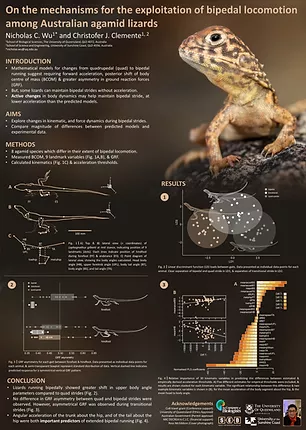
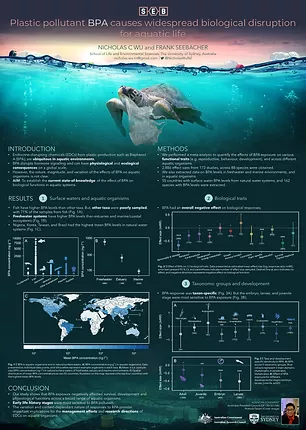
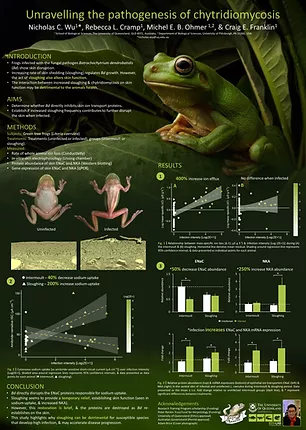

```{r setup, include=FALSE}
knitr::opts_chunk$set(echo = TRUE, cache = FALSE, tidy = TRUE)
options(digits=2)
```

# **Instructions** {.tabset .tabset-fade .tabset-pills}

<br>

## **Assignment Task** {.tabset .tabset-fade .tabset-pills}

BIOL6207 and BIOL3207 HPO students are expected to undertake an additional assessment task for the course. This task will involve you choosing a scientific paper of your choice on any topic in biology. 

The paper **must** provide data that can be re-analysed so that you can present your re-analysis through a poster presentation. The goal of the poster is to briefly articulate the objectives of the paper, provide your own re-analysis and visual presentation of the data, and an interpretation of your re-analysis in relation to the papers main question. 

There are a host of resources for you to learn about how to make good quality scientific posters. You may want to look [here](https://guides.nyu.edu/posters), [here](chrome-extension://efaidnbmnnnibpcajpcglclefindmkaj/https://students.unimelb.edu.au/__data/assets/pdf_file/0007/470059/Academic_posters_Update_051112.pdf), [here](https://www.science.org/content/article/how-prepare-scientific-poster) and [here](https://www.animateyour.science/post/how-to-design-an-award-winning-conference-poster) as starting places.

**You will be required to provide a pdf version of your poster through Wattle by October 24th at 5:00PM 2022**. **You will also need to upload your Rmarkdown file that you used to analyse and plot the data form your chosen paper**. We need the posters by this point in order to organise printing. We will organise printing of the poster for you for Friday's (October 28th, 2022) workshop. At the workshop you will be required to stand by your poster and answer any questions that other students, demonstrators, Eric or Dan have about your paper and re-analysis of the data. 

The poster conference is meant to be fun! We will provide pizza and drinks and it will be a great way to end the semester. 

<br>

#### Just some examples of good posters!





## **Assessment** {.tabset .tabset-fade .tabset-pills}

<br>
**This assessment is specifically designed for BIOL6207 students, or BIOL3207 students who want an HPO on their transcript. For BIOL6207 students the assessment is worth 20% of your final mark. You are to work independently on analysing data and constructing your posters.** 
<br>

You will be assessed on five major areas: 

i) **Introduction to the paper (10%)** 
    + Based on your reading, provide a brief summary of the paper in your own words 
    + Identify the knowledge gaps identified by the paper
    
ii) **Clear articulation of the problem / question / aims of the paper (10%)** 
    + Provide a clear statement of the major aims, questions, hypotheses of the paper

iii) **A brief summary describing how the data was collected (15%)**
        + Provide a summary of how the data was collected
        + If sensible, use a figure to provide an overview of the experimental design
        + Clearly identify the key variables that are relevant to the question
        + Provide a brief few statements of the statistical approaches you used to analyse the data and why
    
iv) **Statistical analysis and interpretation of results in relation to the question (20%)** 
      + Statistical analysis is appropriate for the question and variables
      + Results are correctly and accurate presented and described
      + Meaning and interpretation of the results in relation to the question(s) are correct

v) **Quality and appeal of figures and their relevance to the question / aims / objectives (25%)** 
      + Figures are labelled correctly
      + Information rich, but without too much detail
      + Figures are clearly described by legends
      + Colour schemes chosen are appropriate
      + Figures contain useful visualisation of the results in relation to the main aims / questions / objectives
        
vi) **Overall presentation, layout and aesthetics of poster (20%)**
      + Layout of the poster is visually appealing
      + Poster does not contain too much text
      + Figures are appropriately placed and organised
      + Knowledgeable about the poster, and answers questions about the analysis and paper sufficiently well
        
