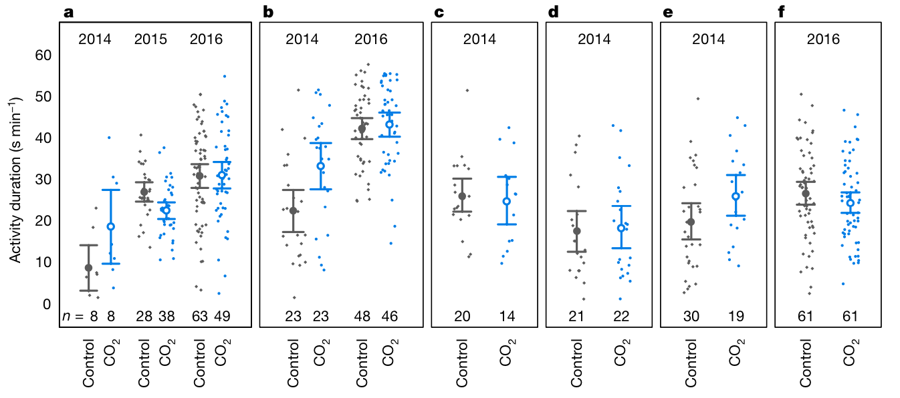

```{r setup, include=FALSE}
knitr::opts_chunk$set(echo = TRUE)
library(vembedr)
```

```{r klippy, echo=FALSE, include=TRUE}
library(klippy)
klippy::klippy(
  lang = c("r", "markdown"),
  all_precode = FALSE,
  position = c("top", "right"),
  color = "darkred",
  tooltip_message = "Copy code",
  tooltip_success = "Copied!"
)
```

### **Learning objectives** {.tabset .tabset-fade .tabset-pills}

*   What is version control?
*   What is GitHub and why use it?
*   What's the difference between Public/Private repos?
*   How to set up a repo?
*   How to commit?
*   How to add collaborators?
*   How to use issues?
*   How to resolve conflicts?

<br>

#### Ground rules {.tabset .tabset-fade .tabset-pills}

Here are a few ground rules to keep things running smoothly:

1. Do your best to attempt each task on your own before asking for help from the instructors or your neighbour

2. When you get to a green box, stick the green sticky note to your laptop (or give yourself a green 'yes' tick on zoom)

3. If you need help, stick the red sticky note to your laptop (or raise your hand on zoom)
<br>

#### Getting un-stuck {.tabset .tabset-fade .tabset-pills}

Remember, no programmers know it all, so don't struggle alone too long, but before you ask for help do try:

* If you're looking for ideas of how to start:
  * googling for what you want to do (e.g. 'creating a repo github')
  * searching [GitHub Desktop Documentation](https://docs.github.com/en/desktop/installing-and-configuring-github-desktop/overview/getting-started-with-github-desktop) for what you want
  * use the amazing [Git Tutorial Videos](https://www.gitkraken.com/learn/git/tutorials)

If none of this works, ask your neighbour, use your red sticky note (or raised hand on zoom) to get help from a demonstrator. 
<br>

#### Before you begin {.tabset .tabset-fade .tabset-pills}

>Before the workshop you should have already downloaded [*GitHub Desktop*](https://desktop.github.com/) and created an [*GitHub*](https://github.com/) account. If you haven't already done so please do this **before** starting the tasks.

<br>


# **Introduction**

Fundamental to project organisation is maintaining a consistent, uniform and simple set of working files that can be understood by your future self, collaborators and interested folks wanting to reproduce your analyses or re-use code or your data. We also want to keep a history of how such files change in case we find some new code we write results in older code no longer running. 

For complex projects with many collaborators maintaining tidiness and keeping track of changing files can be very challenging! While file sharing services like *Dropbox* and *OneDrive* are easy to use and can maintain a consistent file set on your computer(s) and/or among collaborators it has some disadvantages. It can’t tell you what has changed within files. It also can’t easily deal with conflicts between files when you and your collaborators are working at the same time on the same things. 

This often leads to a build up “too afraid to delete” files that no one, including yourself, knows what to do with, but you're too afraid to delete in case you ruin something. A little bit of organising can keep chaos from compounding and maintain reproducibility (for both you and others) through the development of data science projects.

Ideally, it would be nice to easily see the current (and hopefully best) set of files, but to be able to see who has changed them and what specific parts of the files have been modified. We also want a workflow that allows us to go back in time -- a history that has documented the evolution of files -- in case something has changed that breaks your code. Keeping a record of how files for a particular project has changed is also important to be able to quickly solve problems when (not if) they arise. 

### **Version Control to the Rescue!**

What is version control? Version control is a file storage, documentation and tracking system. In other words, it allows you to keep a documented history of files and file structures as a specific project develops. It's used extensively in data science for: 1) building code and programs; 2) analyzing biological data and 3) maintaining databases. 

>**Git** is a type of version control system that we'll be using in this workshop. It's extremely powerful and is probably the most widely used version control system, not only in biology, but a multitude of different fields (e.g. computer science, engineering etc). 

```{r, echo=FALSE}
embed_url("https://www.youtube.com/watch?v=xQujH0ElTUg") %>% use_align("center")
```

### **GitHub and GitHub Desktop**

Now that you know that *Git* is a type of version control system, and you know more about how version control works, what is *GitHub*? 

*Git* is great because it allows you to track files and file structure on your local computer. However, what if you want to collaborate? We need a 'cloud' interface that makes use of the power of *Git*, but allows everyone to have the same history of events. 

That's where *GitHub* comes into play. *GitHub* is essentially the cloud/online version of your *Git* project. It hosts your files, and the history of the project, in the cloud! *GitHub Desktop*, in contrast, is the application that you use to communicate changes on your local computer up to *GitHub*. Once you make changes to files in your repo on your local computer you then **add** these files to the staging area, **commit** a detailed message about what was changed and why, and then **push** these changes to *GitHub*. These changes are then available to be **pulled** down from the cloud by your collaborators. You must *push* changes up for them to be sent to the cloud. This workflow allows a project to be in sync across many, many different local computers. 

```{r, fig.align='center', echo = FALSE, fig.cap="Git and GitHub make for a powerful collaborative version control system. GitHub Desktop is a useful application that is used to interface your local Git project with GitHub."}
magick::image_read("./videos/mgithub.jpg")
```

The **pull**--**add**--**commit**--**push** sequence is all you need to remember when working in a *GitHub* repository, particularly if you have collaborators. Before you start, **pull** down any new changes that might be in the cloud because your collaborator might have been pulling an 'all nighter' to get some data analysis done. You want to make sure that you have the most recent version of their files. Then, you go on to work normally and remember to **add** and **commit** files regularly as you get important work finished. You can push up all at once, or you may want to push changes a few times a day so that the project in the cloud has your most up-to-date files as well. 

>**Important**: Binary files like word and excel files are not good to track because Git will not be able to track their contents. Try to keep the files you track to simple tex-based files like `.txt` and `.csv`. 

#### Public versus Private Repositories

*GitHub* has two types of repositories. 'Private` repositories are those that are only accessed and viewed online by you and your collaborators on the project. 'Public' repositories are those that can be viewed by *anyone*, even if they are outside the project. 

By default, *GitHub* creates 'public' repos and you need to actually pay for 'private' repos. The reason is that *GitHub* is encouraging code sharing and transparency but also community coding by keeping the code open source. This is arguably one of the major successes of *GitHub*. Anyone can access the code, modify it, improve upon it or even update it with new features. This is incredibly valuable because it can result in code and data being more broadly accessible, usable, robust and encourage new and exciting collaborations. 

Don't worry though. People can't just change your repo. They still need to be invited as collaborators or you need to approve of a `pull request` if these changes are to take effect in your repo. 

### **Advantages of Version Control (Git)** 
There are major advantages of using version control over just using *Dropbox* / *OneDrive*.

1. It keeps track of all files relevant to a specific project and/or that are necessary for its reproducibility by assigning them a unique identifier.

2. It documents the evolution of every file in a project, including data, manuscripts and code, by permitting the user to assign a commit tag describing how the file or set of files has changed.

3. It automatically indicates who, when and where a specific file was modified, identifying the in text locations that have changed.

4. It keeps a recorded history of all the changed files, allowing you to move back in time to look at older version of files or the state of the project at an earlier time.

5. It auto merges files that you and collaborators are working on at the same time and introduces conflict markers in the text of the file if the same lines have been edited. This forces you and others to deal with and correct conflicts immediately.

6. It makes running analyses and scripts on servers much easier.

7. It promotes easier collaboration between lab members and co-authors by keeping files in sync and annotated across diverse platforms.

8. It makes it much easier at the end of a project to quickly share and store data and code relevant for reproducing the project (analyses, paper etc) which is often a necessary pre-requisite for publishing.

9. It makes it easier to correct mistakes within a project by allowing you to track down the relevant colleague (or *vis versa*) when issues arise after updates or changes.

10. It forces you to think about the relevant parts of the project that are essential for it’s reproducibility and allows you to customize what is tracked.

# **Let's jump in!**

Now that you have some familiarity with *GitHub* and *Git*, lets try to get ourselves set up and orientated. In groups, find a partner and complete the following tasks. Think about how you would describe to others how to complete these tasks. Two of you from a single group will be chosen randomly to come up and teach the class how to complete each task.

:::: {.organgebox data-latex=""}
::: {.center data-latex=""}
<font size="18">**Task 1 & 2** should take ~20 minutes</font>
:::
::::

# **Task 1**: Setting up a repository (repo)

Create a new repository (repo) on your [*GitHub*](https://github.com/) account. Make sure the repo is public and initialize the repo with a 'README.md" file. It should ask you this during the setup. Keep the repo name: 

1) Informative; 
2) Short; 
3) Avoid 'spaces' in your repo name. For point 3, you can use '_' (i.e., 'snake case') or '.' between words. This makes it easier when you want to code path names to your project. 

When you are done, copy the url to your repo. In your `git_fishes_student.Rmd` file add in the link to your repo.

# **Task 2**: Clone your repository

Great! You have a repo. Now what? It's currently up in the cloud. That's not as useful as having it on your computer. 
For your next task, clone down your repository to your computer. Cloning makes a 'copy' of your new repo -- creating a new folder on your computer. This folder is somewhat special though because it retains 'lines of communication' with the folder on *GitHub*. 

Use the [*GitHub Desktop*](https://desktop.github.com/) application you downloaded on your computer to clone your new repository. 

When you are done, answer a few questions in the `git_fishes_student.Rmd` file.

<br>

:::: {.greenbox data-latex=""}
::: {.center data-latex=""}
<font size="18">**Relax!**</font>
:::
**When you get to this point relax. See if you can help others in your group. We'll quickly overview the solutions or have reps from a random group present their solutions soon.**
::::

<br>

:::: {.organgebox data-latex=""}
::: {.center data-latex=""}
<font size="18">**Task 3--5** should take ~30-40 minutes</font>
:::
::::

# **Task 3**: Adding files, commiting (staging) and pushing to GitHub

Now that you have your *GitHub* repo cloned (i.e., downloaded) onto your computer navigate to this folder. 

>**Hint**: `GitHub Desktop` has a handy feature on the repo's front page for you to click on and take you directly to the folder)

Create: 

1) a new RStudio project file in your working directory
2) download the `OA_activitydat_20190302_BIOL3207.csv` from Wattle and add this to a `data/` folder in your repo 
3) Add the template Rmarkdown file, `git_fishes_student.Rmd` that was provided on wattle. You'll use this file to work through the tasks and answer questions. 

Once added go back to your *GitHub Desktop* application. What has changed? Commit a message for each file about why you added these files and push this up to your *GitHub* repo. Take a look at your *GitHub* repo online. What has changed?

# **Task 4**: Editing file, saving, committing and pushing to GitHub

Now that you're tracking your Rmarkdown file your ready to start doing some coding. We're now going to do some data-wrangling of the `OA_activitydat_20190302_BIOL3207.csv` data. In the process we will save the files as we develop code, commit and track the file. The `OA_activitydat_20190302_BIOL3207.csv` is a data set on ocean acidification effects on fish behaviour that was published in [Nature in 2020](https://www.nature.com/articles/s41586-019-1903-y). The detailed meta-data for each column are as follows:

| Column Name	|	Description	  |
| -------------	|	:-----------: |	
| loc		|	Location, and year, where the data were collected. AIMS = Australian Institute of Marine Science; LIRS = Lizard Island Research Station |
species	|		Species name: acantho = Acanthochromis; Ambon = Pomacentrus amboinensis; Chromis = Chromis atripectoralis; Humbug = Dascyllus aruanus; Lemon = Pomacentrus moluccensis	|
treatment	|	Elevated CO2 [CO2] (850-1,050 µatm) or control [Control] (400 - 450 µatm) groups |
animal_id	|	Fish identity |
sl	|		Standard length of the fish in mm |
size	|		Size grouping of the fish, separated at 15 mm standard length into 'big' or 'small' |
activity	|	Number of seconds the fish was active per minute, averaged across the duration of the trial |
comment		|	Comment with notes on the origin of the data | 

Complete the following:

Clean up the data. There are a bunch of extra columns and missing data in the dataset. Use your new found data wrangling skills to explicitly code a chunk to:

a) Remove the missing data
b) Drop out columns that are not relevant (e.g, `comment` column and `loc` can probably go for now).
c) Check that there are no spelling issues in `species` and `treatment` and create a table of summary data that includes:
  + the mean 
  + the standard error 
  + the sample sizes of unique fish across **ALL** fish species for each treatment.

Once you have finished adding this code, save this file, commit and push it up to *GitHub*. Check again how your *GitHub* repo online looks. Click on the file and see what in the file has changed.

# **Task 5**: Adding .gitignore file to control tracking

Not all files in a repo need to be tracked by Git. For example, anything that you create using R code in your Rmarkdown files, such as figures or rendered htmls, need not necessarily be tracked. That's because, well, the code can re-create these figures. Complete the following:

1) In RStudio, create a text file called `.gitignore` and save this file to the root of your repo. The "root" is the main directory folder that you cloned down. 
3) In your repo, add the following folders: `output/figures/`. In short, add a folder called `output/` in the main directory and then, **inside** the `output/` folder add a `figures/` folder. Add the path to the figures folder to your `.gitignore` file and save this file. 
4) In your Rmarkdown file, use the data that you stored (i.e., `OA_activitydat_20190302_BIOL3207.csv`) to create one or more figure(s) (see you Rmarkdown instructions), and save this figure(s) to the `output/figures/` folder. Check your *GitHub Desktop*. What do you notice?

Commit and push the `.gitignore` file to your repo. What do you notice about the differences in file structure on *GitHub* compared to your local directory?

<br>

:::: {.greenbox data-latex=""}
::: {.center data-latex=""}
<font size="18">**Relax!**</font>
:::
**When you get to this point relax. See if you can help others in your group. We'll quickly overview the solutions or have reps from a random group present their solutions soon.**
::::

<br>

:::: {.organgebox data-latex=""}
::: {.center data-latex=""}
<font size="18">**Task 6--8** should take ~30-40 minutes</font>
:::
::::

# **Task 6**: Adding collaborators to your repo

You now have a repo that's ready to share with the world. You've made this repo public, so everyone can see it, which is very transparent! Others can always join in on the fun. Great work. 

Let's now invite a collaborator. Complete the following:

1) Team up with the person beside you. For those online we'll organise you in breakout rooms!
2) Ask them for their GitHub username and add them to your *GitHub* repo. This is done on your *GitHub* repo through the browser by managing collaborators in the `settings` tab. You should also give **them** your username so they can do the same for you. 
3) Once added to their repository, clone **their** repository onto your local computer. 
4) Open up **their** Rmarkdown file. Re-run their code to check it all runs fine on your computer. It should!
5) Add a new code chunk that creates a different figure than the one your collaborator made or edit the code on their existing figure. See the Rmarkdown for details.
6) Save the file. 
7) Commit and push these changes up.

# **Task 7**: Resolving conflicts

Conflicts are common. They occur when you and your collaborator are working on the same lines of the same file. If you are working on different parts of the same file *Git* will auto-merge these changes. It will do this seamlessly for you. However, it's more common than you think that you and your collaborator are editing the same place of a file. *Git* is powerful for resolving these conflicts (assuming you're working with .txt or .csv style files). 

Create a conflict yourself and learn how to recognize conflicts and resolve them when they happen. 

Complete the following:

1) You and your partner should open the same file at the same time. To keep it simple, open the `README` file. 
2) Each of you edit the same line in the file. For example, each of you can give the title of the project a different name.
3) Each of you save the file.
4) Tell your partner to commit and push up their changes to *GitHub*. You do the same with your partner's repo.
5) Each of you now pull down the change. What do you notice happens to your file when you pull down the changes? What does *GitHub Desktop* tell you?
6) Open the 'conflicted' README file.
7) What do you see in the file? Describe in your notebook what is different about the README file.
8) Resolve the conflict. Pick a change you like best, delete all other conflict markers and text.
9) Commit and push up the changes to *GitHub*

Once complete, update the README file with more details about how to reproduce the project. Describe the workflow, which files are the most relevant and include meta-data that describes the data columns and what they mean. 

# **Task 8**: Creating an issue on *GitHub*
Now that you have a collaborator it's a good idea to create a To Do list. One place to do this is though *GitHub* issues. Issues can be used to identify bugs in code or suggest enhancements / additions to code, to get collaborators to check data or even just create a to do list so everyone has tasks that they can keep track of. We'll use it to set up a set of tasks for the project. Assume the project will be for you and your collaborator to analyse a big biological dataset together. 

Complete the following steps:

1) Create a new 'To Do List' issue on your *GitHub* project.
2) Create a *To Do* 'tick' box that lists three different tasks that will be the next steps in setting up the project. These tasks could be anything. Adding more data, updating the README or meta-data, running some exploratory analysis and adding plotting code. 
3) Use tags to identify who (you or your partner) is meant to do those tasks. 

<br>

:::: {.organgebox data-latex=""}
::: {.center data-latex=""}
<font size="18">**Task 9** should take ~40-60 minutes</font>
:::
::::

# **Task 9**: Pulling down changes and adding some statisical tests

Your partner has made some changes. You won't see these changes yet because they are on *GitHub* in the cloud!

Complete the following steps:

1) Go to your *GitHub Desktop* application. Pull down changes to *your* repo that your partner sent to *GitHub*.
2) Review these changes. Re-run their code to make sure that it works. If it doesn't work try to work with your neighbor to determine why. 
3) If the code runs then add a summary statistics and statistical results to explore whether the control vs high $CO^2$ treatments differ for each of the five fish species. See markdown for more details.
4) Make a pretty table that summarise the results for each species.

Once complete, stage, commit and push up these new changes up to *GitHub*.

<br>

:::: {.bluebox data-latex=""}
::: {.center data-latex=""}
<font size="18">**Stretch Task**</font>
:::
**This task is bonus. Try it out if you have time. The task is designed to show you some handy features of *GitHub* to make your repo more visible/shareable and also demonstrate the challenges with reproducing others' work**
::::

<br>


# **Task 10**: Reproducibility and GitHub Webpages 

*GitHub* is not only a great place for hosting your project, but it's also useful for hosting webpages! This can be really useful for providing a simple way for others to 'see' your results. You simply just send them the link. This in combination with *Git* and *Rmarkdown* can also be powerful for improving the reproducibility of your data science projects. 

The Clark *et al.* (2020) paper provides all the data and code needed for reproducing their analyses and figures. This is great to see! It makes the paper reproducible. However, it could be better. Now that you know how to make analyses reproducible using Rmarkdown documents, lets try and reproduce *Fig.4* in their paper using `ggplot` and make the rendered Rmarkdown document more easily accessible through a GitHub Webpage. 

Here's what *Fig. 4* from Clark *et al.* (2020) looks like again:



### Write a reproducible Rmarkdown file that reproduces Fig.4

You have already been using the data for this task (`OA_flumedat_20190302_BIOL3207.csv`) which was downloaded from Wattle. However, we've also put up the analysis code that the authors provide with their paper. The `OA activity analysis script_3207.R` was used to analyse these data. To make things a little more clear, we've also put up a `readme_3207.txt` file that describes the data and analysis script in a little more detail. 

Metadata files are important in describing the dataset -- e.g., what the variable names are and how it connects with the script. The .R script also provides some code to make the plot, but in base R, not using `ggplot`. 

Create a new Rmarkdown file, but this time, call it `index.Rmd`. It's not a very informative name, I know. However, by naming it `index.Rmd` when you push it up to *GitHub* after being rendered it will immediately recognise this file as being special and create the 'homepage' for your new reproducible webpage. 

Have a close look at their code to understand a little better what they did. Add Question 9 below to your new `index.Rmd` and provide an answer:

```{r, eval=FALSE}

>**Question 9**: Think about some things that can be improved in their code. 
List 3 things you think could be improved and provide a brief explanation for why.

# 1)
# 2) 
# 3)
```

With your new `index.Rmd` Rmarkdown file write code to reproduce Fig. 4 using `ggplot`. To re-make this figure, you may want to look at some handy `ggplot` tools like the R package `patchwork` or `ggarrange`, which helps you arrange figures side-by-side and provide labels (e.g., a, b, c etc). Explore these packages. 

After you're done, add this code to to your `index.html` and answer the question. 

```{r, eval=FALSE}

>**Question 10**: What are the challenges, if any, that you encounter in reproducing this figure?

# Describe challenges
```

### Turn your Rendered Rmarkdown into a *GitHub* page

Even with the data and code provided you might still find it hard to reproduce their figure. You would be surprised how common this can be. Even if you haven't managed to completely reproduce the figure you can still setup a *GitHub Webpage*. To do that go to your *GitHub* repo in a browser window. Do the following:

1) Click the 'settings' tab of the repo (note that this is not the settings for your profile!).
2) On the left panel under "Code and automation" click "Pages".
3) Under "Branch" choose the branch you want your webpage to be deployed from. In this case, choose 'main'
4) GitHub pages will now look for a README.md or index.html to render as your "home page". After a short wile, under the 'GitHub Pages' you will see a link for your repo. It will be labelled: https://your_username.github.io/your_repo_name. You can visit this site and give it to anyone.
5) Render your `index.Rmd` Rmarkdown file to an HTML called `index.html`.
6) Stage, commit and push `index.html` up to your *GitHub* repo. Remember, your `.gitignore` file maybe ignoring `html` files. However, in this case, we want to now push this file up so that our *GitHub* pages can create the 'website'. So, remove the `*.html` from your ignore file. 
7) Wait a little bit for GitHub pages to create the site (~5 min).
8) Now, go visit your site and share it with your partner so they can see the analysis and code you created!

